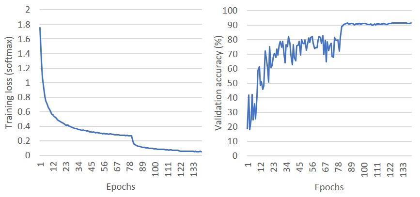

## PCNN
Sunwoo Lee <sunwoolee1.2014@u.northwestern.edu> <br />
PhD Candidate <br />
Northwestern University <br />

Parallel Convolutional Neural Network (PCNN) is a light-weighted software framework for parallel deep convolutional neural network training. PCNN implements data-parallelism with a communication-efficient gradient averaging method. PCNN provides an overlap of computation and communication by employing a communication-dedicated thread which calls the synchronous MPI operations in background.

### Publication

[S. Lee et. al, Improving Scalability of Parallel CNN Training by Adjusting Mini-Batch Size at Run-Time. IEEE BigData 2019](http://cucis.eecs.northwestern.edu/publications/pdf/LKM19.pdf)

[S. Lee et. al, Communication-Efficient Parallelization Strategy for Deep Convolutional Neural Network Training. SCW 2018](http://cucis.eecs.northwestern.edu/publications/pdf/LAB18.pdf)

[S. Lee et. al, Parallelizing Deep Convolutional Neural Network Training by Exploiting the Overlapping of Computation and Communication (best paper finalist). HiPC 2017](http://cucis.eecs.northwestern.edu/publications/pdf/LJA17.pdf)

### Example classification result
 - [Cifar-10](https://www.cs.toronto.edu/~kriz/cifar.html) dataset
 - [ResNet-20](https://arxiv.org/pdf/1512.03385.pdf) model
 - Top-1 validation accuracy (91.68%)
 - Momentum SGD (lr=0.1, batch size=128, weight decay=0.0001, lr decay=0.1, lr decay interval=80/40 epochs)
 

### Software Dependency
PCNN uses the following third-party libraries.
 - OpenMP: parallelizes non-kernel operations in shared-memory programming model.
 - MPI: data-parallelism is implemented using MPI in distributed-memory programming model.
 - OpenCV: JPEG images are read and pre-processed using OpenCV library.
 - Intel MKL: A highly-optimized math library used for the kernel operations such as matrix-matrix multiplication.
 - boost: utility functions such as random number generators are implemented using boost library.
 
### Supported CNN features
PCNN supports the following optimizers.
 - SGD
 - Momentum SGD
 - Adam
 - localSGD
 
PCNN supports the following types of layers. 
 - Convolution layers
 - Max/Avg-pooling layers
 - Fully-connected layers
 - Upsampling layers (super-resolution)
 
The following loss functions are supported.
 - Softmax
 - MSE (L2)
 - MAE (L1)

PCNN supports only Rectified Linear Unit (ReLU) as an activation function.

Additionally, PCNN supports the following optimization techniques.
 - Momentum
 - Learning rate decay
 - Residual connections
 - L2 regularization (a.k.a. weight decay)
 - Batch normalization (currently, only for convolution layers)
 
### Supported parallelization strategies
PCNN supports data-parallelism using two communication patterns:
 - Allreduce-based gradient averaging (traditional approach)
 - Multi-step communications for gradient averaging

### Supported dataset
PCNN supports a couple of popular classification benchmark datasets: MNIST, CIFAR-10, and ImageNet, and a few regression dataset: DIV2K, Phantom, and Climate datasets. Ghost batch is the psuedo dataset that can be used for timing measurement. The proper flag and path variables should be set in config.h.

Example: CIFAR-10 dataset
1. Set #define CIFAR10 to 1 and all the other dataset flags to 0. 
2. Set #define CIFAR_TRAIN_TOP_DIR to the path where the training data is located.
3. Set #define CIFAR_TEST_TOP_DIR to the path where the test data is located.
4.  make clean; make

For other datasets, the path variables should be defined in a similar way.

### Predefined model architectures
PCNN supports a few popular model architectures in arch.c. The model should be chosen in config.h.
 - LeNet
 - ResNet20 / ResNet-50
 - VGG-16
 - DRRN
 - EDSR

### How to build
1. In order to use Intel MKL related environment variables, run the MKL script first, for example
 ```
 source $HOME/intel/mkl/bin/mklvar.sh intel64
 ```

2. Generate configure file using autoreconf tool.
 ```
 autoreconf -i
 ```

3. Run 'configure' with the OpenCV path, for example
 ```
 ./configure --with-opencv=$HOME/lib/opencv
 ```

4. Run 'make' to create the executable 'pcnn'.

### How to run
#### How to setup input data
To use PCNN, the data feeding part should be implemented based on the training data.
1. `DEPTH`, `WIDTH`, and `HEIGHT` of each training sample should be defined in config.h
2. `LABEL_SIZE` should be defined in config.h, which indicates the problem type (e.g., 10 for 10-class classification problems).
3. All the hyper-parameters should be specified in config.h, including mini-batch size, initial learning rate, and many others.
4. `TRAIN_TOP_DIR`, `TEST_TOP_DIR`, `TRAIN_LIST`, and `TEST_LIST` should be defined in config.h

Once all the dataset-dependent features are described in config.h, an appropriate data feeding function should be implemented.
By default, CIFAR10 and ImageNet data feeding functions are provided in feeder.c.

#### How to run PCNN
 ```
  mpiexec -n <np> ./pcnn [-s num] [-e num] [-t path] [-g num] [-i num]

  [-s]         enable training data shuffling (default: 0)
  [-e]         number of epochs to run (default: 1)
  [-t]         path to the checkpoint files
  [-g]         number of groups in local SGD training
  [-i]         model parameter averaging interval in local SGD training
  ```

### Checkpointing
#### Checkpoint Configurations
PCNN performs checkpointing based on the checkpoint configurations in config.h
In config.h, `CHECKPOINT_INTERVAL` indicates how frequently the model parameters are stored with respect to the number of epochs.
`CHECKPOINT_PATH` is the folder in which the checkpoint files will be stored.

#### How to resume the training
1. Assuming the training algorithm is SGD, copy 'check-g0-xx.data' into the top folder after renaming it to 'check-g0.data'. Note that xx is the number of trained epochs.
2. Run PCNN with the `-t` option.
3. If the training algorithm is local SGD, repeat the step 1 for all the groups.
