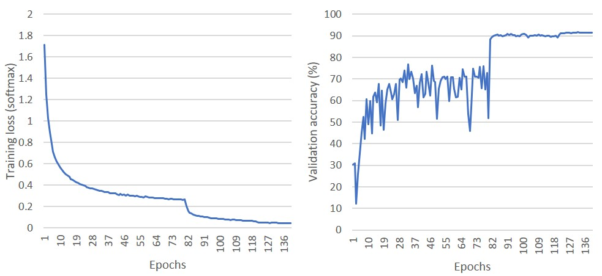
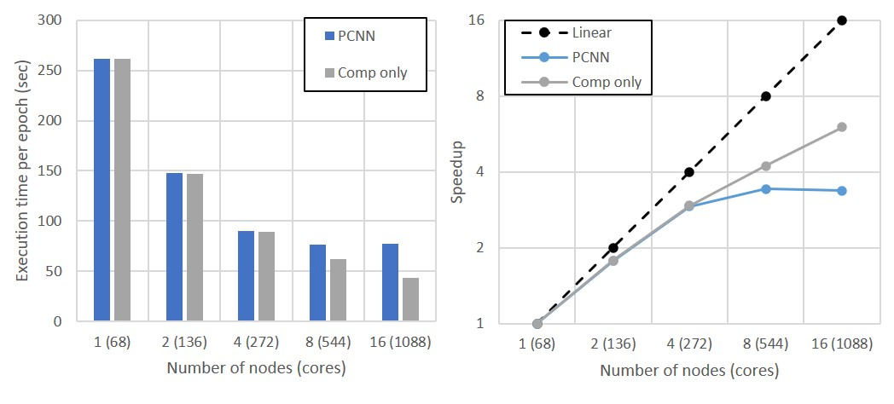
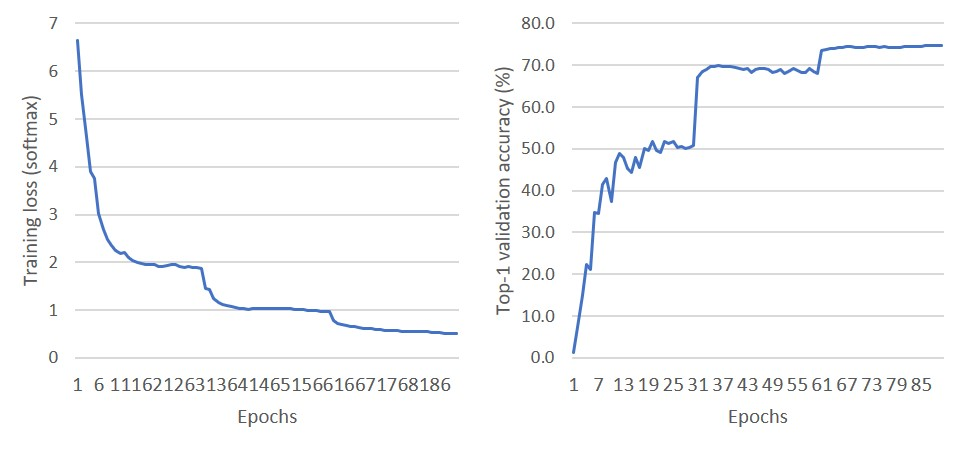
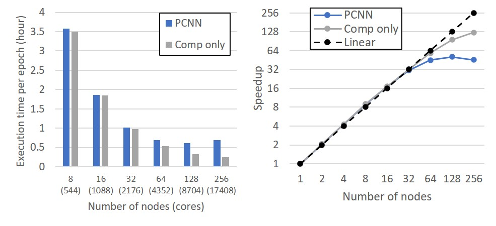

# Classification with PCNN
To solve classfication problems with PCNN, users should define the model architecture and specify the hyper-parameters.
PCNN provides a few example code for open classification datasets, MNIST, CIFAR10, and ImageNet. 

## Setting Up Hyper-Parameters (e.g., CIFAR10 classification)
CIFAR10 is a 10-class classification dataset that is publicly open.
It consists of 3-channel (RGB) 50,000 training images of size 32 x 32 and 10,000 validation images.
The dataset can be obtained [here](https://www.cs.toronto.edu/~kriz/cifar.html).

* To train a model on CIFAR10 with PCNN, first users should define a model in `arch.c`. PCNN supports ResNet20 as the default model architecture for CIFAR10 classification.
* Then, specify the dataset in `config.h` as follows.
```
/********** Model settings ********************/
#define MNIST_MODEL 0
#define CIFAR10_MODEL 0
#define VGGA 0
#define RESNET20 1 // for cifar10
#define RESNET50 0 // for imagenet
#define EDSR 0
#define DRRN 0
#define VDSR 0
```

* Specify the task type to classification in `config.h`.
```
/********** Task type *************************
 * 0: CLASSIFICATION
 * The typical image classification task.
 * 1: REGRESSION
 * Cost minimization task. (e.g., image restoration) */
#define TASK_TYPE 0
```

* Specify the dataset in `config.h` as follows (#define CIFAR10 1).
```
/********** Dataset settings ******************/
#define MNIST 0
#define MNIST_DEPTH 1
#define MNIST_WIDTH 28
#define MNIST_HEIGHT 28
#define MNIST_LABEL_SIZE 10
#define MNIST_TRAIN_TOP_DIR "/home/slz839/dataset/mnist"
#define MNIST_TEST_TOP_DIR "/home/slz839/dataset/mnist"
#define MNIST_TRAIN_IMAGE "train-images-idx3-ubyte"
#define MNIST_TRAIN_LABEL "train-labels-idx1-ubyte"
#define MNIST_TEST_IMAGE "t10k-images-idx3-ubyte"
#define MNIST_TEST_LABEL "t10k-labels-idx1-ubyte"

#define CIFAR10 1
#define CIFAR10_DEPTH 3
#define CIFAR10_WIDTH 32
#define CIFAR10_HEIGHT 32
#define CIFAR10_LABEL_SIZE 10
#define CIFAR10_TRAIN_TOP_DIR "/home/slz839/dataset/cifar10"
#define CIFAR10_TEST_TOP_DIR "/home/slz839/dataset/cifar10"
#define CIFAR10_TRAIN_IMAGE1 "data_batch_1.bin"
#define CIFAR10_TRAIN_IMAGE2 "data_batch_2.bin"
#define CIFAR10_TRAIN_IMAGE3 "data_batch_3.bin"
#define CIFAR10_TRAIN_IMAGE4 "data_batch_4.bin"
#define CIFAR10_TRAIN_IMAGE5 "data_batch_5.bin"
#define CIFAR10_TEST_IMAGE "test_batch.bin"
```

* Check all the hyper-parameters defined in `config.h`.
```
/********** Optimizer *************************
 * 0: Mini-batch SGD
 * 1: Adam */
#define OPTIMIZER 0
/********** Optimizer-dependent settings ******/
#define WEIGHT_DECAY 0.0001
#define MOMENTUM 0.9
#define ADAM_BETA1 0.9
#define ADAM_BETA2 0.999
#define ADAM_EPSILON 1e-8
/********** Hyper-parameter settings **********/
#define BATCH_SIZE 128
#define LEARNING_RATE 0.1
#define LEARNING_RATE_DECAY_STEPS 80
#define LEARNING_RATE_DECAY_FACTOR 0.1f
```

## Running Parallel Training
Once all the configurations are appropriately set and PCNN is successfully built, the training can be started as follows.
For building the code and input arguments, please refer to the README in `src` directory.
```
mpiexec -n 4 -f nodes ./pcnn -s 1 -e 160
```

## Training Results
The training was performed on Cori KNL nodes, Supercomputer at NERSC.
We used popular training settings as follows.
+ Batch size: 128
+ Initial learning rate: 0.1 (decayed by a factor of 10 after 80 and 120 epochs)
+ Optimizer: minibatch SGD
+ Weight decay factor: 0.0001

The convergence validation accuracy is 91.72%.

<p align="center">

</p>

The parallel training achieves a speedup of 4.2x on 8 KNL nodes and the speedup has been saturated.
Until 4 nodes, most of the communications are overlapped with the computations and the close-linear speedup is achieved.
When running on more than 4 nodes, the communication time becomes longer than the computation time and the exposed communication time ends up being dominant over the computation time.
More performance results are available in our publications ([link](http://cucis.eecs.northwestern.edu/publications/pdf/LAB18.pdf))

<p align="center">

</p>

Finally, we also present ImageNet training results.
We trained ResNet50 with the following settings.
+ Batch size: 256
+ Initial learning rate: 0.1 (decayed by a factor of 10 after 30, 60, and 80 epochs)
+ Optimizer: minibatch SGD
+ Weight decay factor: 0.0005

The top-1 validation accuracy is 75.28%. Note that this accuracy is slightly lower than the state-of-the-art accuracy due to the light data augmentation. With richer data augmentation methods, a higher accuracy can be expected.

<p align="center">

</p>

We also performed the training on Cori KNL nodes.
The parallel training achieved a speedup of 50.96 on 128 KNL nodes.

<p align="center">

</p>

## Questions/Comments
 + Sunwoo Lee <<slz839@eecs.northwestern.edu>>
 + Qiao Kang <<qkt561@eecs.northwestern.edu>>
 + Wei-keng Liao <<wkliao@eecs.northwestern.edu>>

## Project Funding Support
This material is based upon work supported by the U.S. Department of Energy,
Office of Science, Office of Advanced Scientific Computing Research, Scientific
Discovery through Advanced Computing ([SciDAC](https://www.scidac.gov)) program,
[RAPIDS Institute](https://rapids.lbl.gov).
