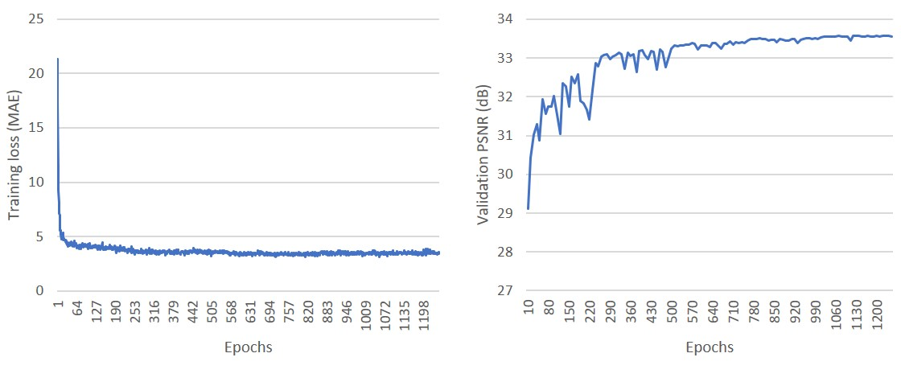
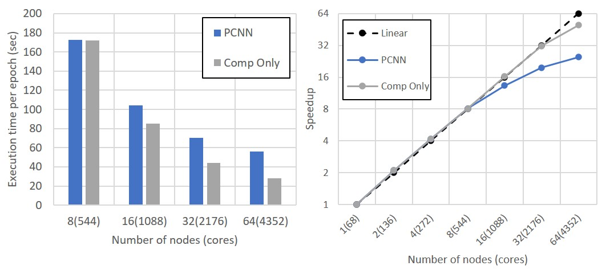

# Regression with PCNN
To solve regression problems with PCNN, users should define the model architecture in `arch.c` and specify the hyper-parameters in `config.h`.
PCNN provides DIV2K super-resolution code as an example.

## Setting Up Hyper-Parameters (e.g., DIV2K super-resolution)
DIV2K is dataset from NTIRE2017 Super-Resolution Challenge, which contains 800 highquality 2K resolution pictures.
The dataset can be obtained [here](https://data.vision.ee.ethz.ch/cvl/DIV2K/).
In this example, we perform 2X super-resolution using EDSR model, a residual network proposed by [Lim et. al](https://arxiv.org/abs/1707.02921).

* To train a model on DIV2K with PCNN, first users should define a model in arch.c. Set `EDSR` to 1 as follows.
```
/********** Model settings ********************/
#define MNIST_MODEL 0
#define CIFAR10_MODEL 0
#define VGGA 0
#define RESNET20 0 // for cifar10
#define RESNET50 0 // for imagenet
#define EDSR 1
#define DRRN 0
#define VDSR 0
```

* Then, specify the task type to regression in `config.h`.
```
/********** Task type *************************
 * 0: CLASSIFICATION
 * The typical image classification task.
 * 1: REGRESSION
 * Cost minimization task. (e.g., image restoration) */
#define TASK_TYPE 1
```

* Specify the dataset in `config.h` as follows (#define DIV2K 1).
```
#define DIV2K 1
#define DIV2K_DEPTH 3
#define DIV2K_WIDTH 48
#define DIV2K_HEIGHT 48
#define DIV2K_LABEL_SIZE 27648
#define DIV2K_TRAIN_TOP_DIR "/home/slz839/dataset/div2k/train"
#define DIV2K_TRAIN_LIST "/home/slz839/dataset/div2k/train/list.txt"
#define DIV2K_TEST_TOP_DIR "/home/slz839/dataset/div2k/test"
#define DIV2K_TEST_LIST "/home/slz839/dataset/div2k/test/list.txt"
```

* Check all the hyper-parameters defined in `config.h`. Note that we used Adam for this example. We also used upsample ratio 2x.
```
/********** Optimizer *************************
 * 0: Mini-batch SGD
 * 1: Adam */
#define OPTIMIZER 1
#define UPSAMPLE_RATIO 2.0f
/********** Optimizer-dependent settings ******/
#define WEIGHT_DECAY 0.0000
#define MOMENTUM 0.9
#define ADAM_BETA1 0.9
#define ADAM_BETA2 0.999
#define ADAM_EPSILON 1e-8
/********** Hyper-parameter settings **********/
#define BATCH_SIZE 16
#define LEARNING_RATE 0.0001
#define LEARNING_RATE_DECAY_STEPS 200
#define LEARNING_RATE_DECAY_FACTOR 0.5f
```

## Running Parallel Training
Once all the configurations are appropriately set and PCNN is successfully built, the training can be started as follows.
For building the code and input arguments, please refer to the README in `src` directory.
```
mpiexec -n 4 -f nodes ./pcnn -s 1 -e 400
```

## Training Results
We present the DIV2K super-resolution results.
All the experiments were performed on Cori KNL nodes, supercomputer at NERSC.
We used all the hyper-parameter settings that appear in [Lim et. al]()(https://arxiv.org/abs/1707.02921) besides minibatch size and learning rate.
* Batch size: 64
* Initial learning rate: 0.0004 (decayed after every 200 epochs)
* Optimizer: Adam
* Adam beta1: 0.9
* Adam beta2: 0.999
* Adam epsilon 1e-8

We achieved validation PSNR of 33.59 dB after 1200 epochs of training.

<p align="center">

</p>

Our parallel training on Cori achieved a speedup of 24.8 on 64 KNL nodes.

<p align="center">

</p>
